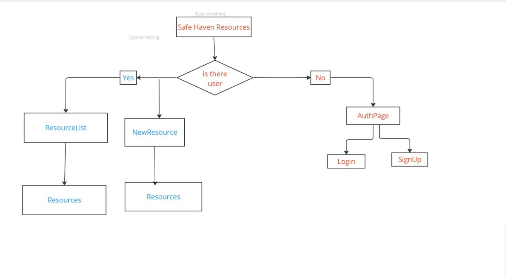
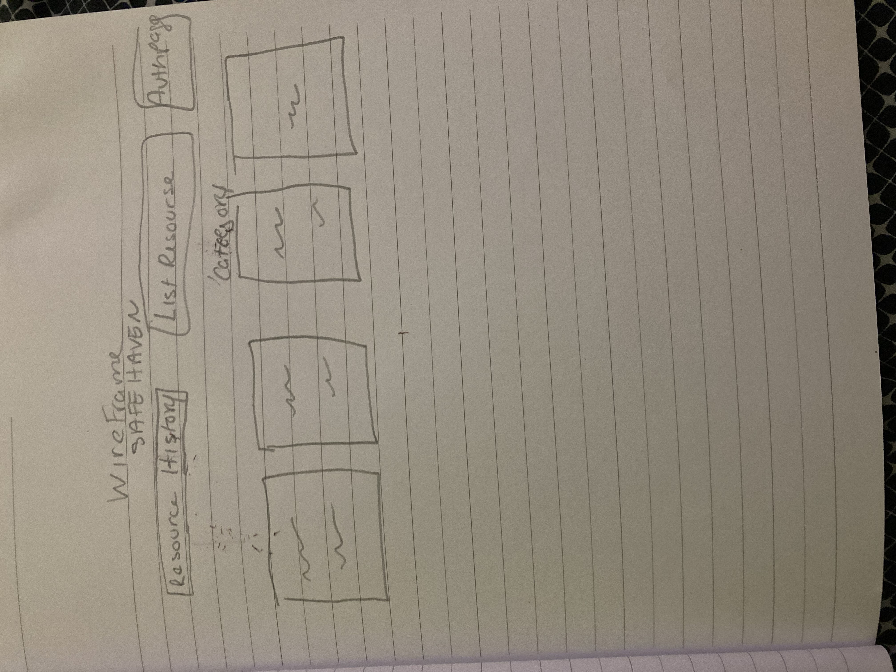

# React + Vite

This resource page is dedicated to providing support and information for individuals, both women and men, who may be experiencing domestic violence. Our goal is to empower survivors with the knowledge and resources they need to seek help and find safety.

Technologies : used APi,Front end used React and Back end used Express and MonogoDB used JWT token based for authentication

todolist https://trello.com/b/57VOZKBh/twoc-mod3-mern-full-stack
flow chart!

wireFrame: 

ERD MOdel:

IceBox: I wanted to add more resources and Categories with more detail 

- [@vitejs/plugin-react](https://github.com/vitejs/vite-plugin-react/blob/main/packages/plugin-react/README.md) uses [Babel](https://babeljs.io/) for Fast Refresh
- [@vitejs/plugin-react-swc](https://github.com/vitejs/vite-plugin-react-swc) uses [SWC](https://swc.rs/) for Fast Refresh
